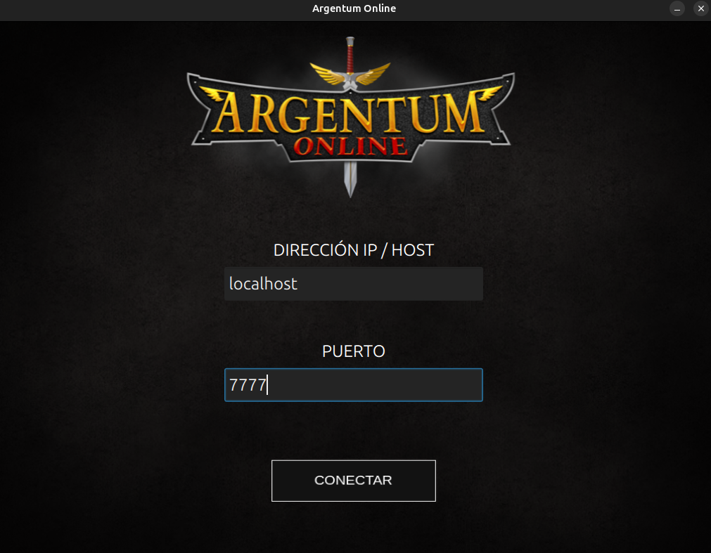
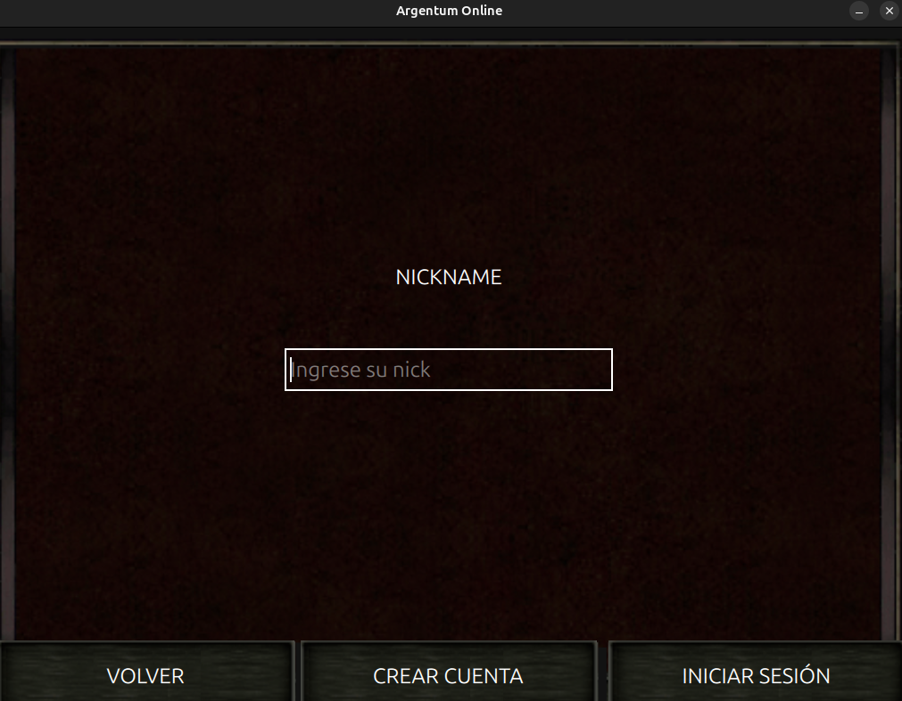
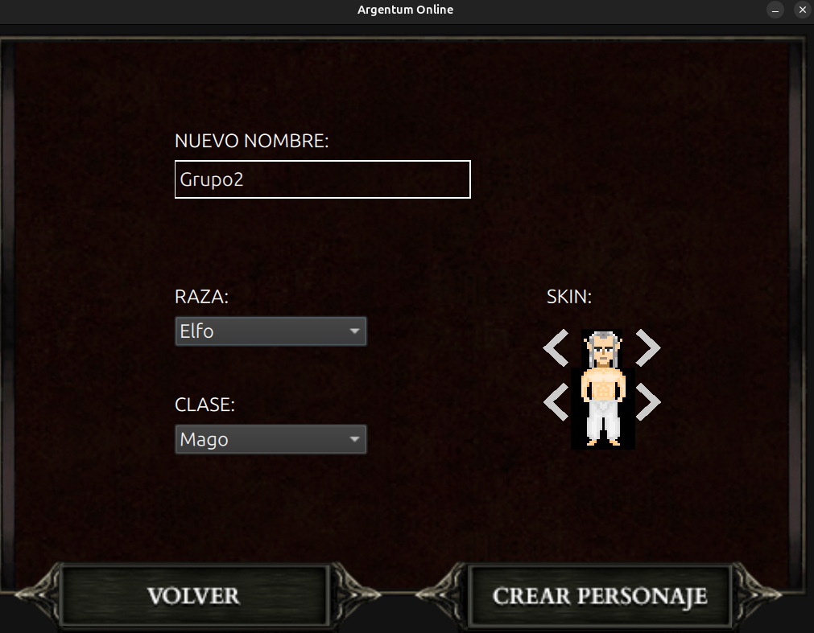
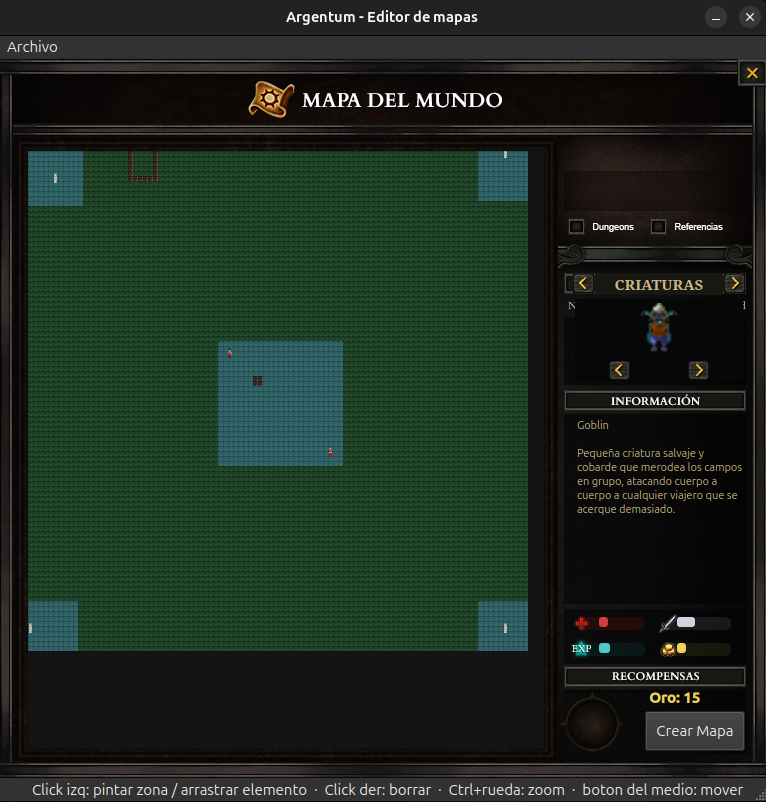
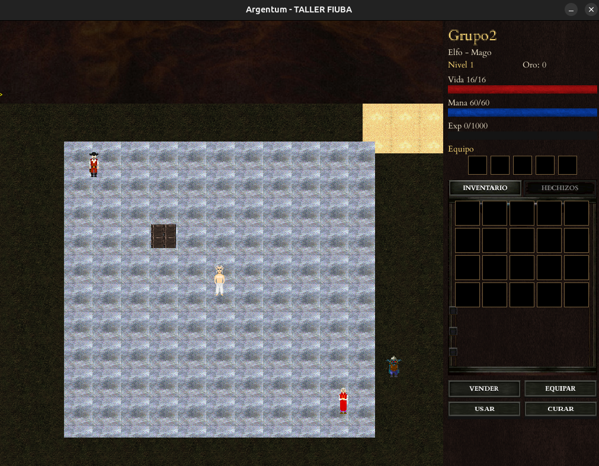

# Argentum Online — TP Taller de Programación I (FIUBA)

Recreación del juego _Argentum Online_: un cliente gráfico (SDL2 + Qt), un
servidor multijugador y un editor de mapas (Qt).

---

##  Integrantes del equipo

- Cristian Roldan 
- Francisco Cordara 
- Ramiro Besse 
- Victoria Zubieta 

---
## Instalación rápida (recomendada)

El instalador hace todo: instala las dependencias del sistema, compila, corre
los tests unitarios e instala los binarios, assets y configuración en las rutas
estándar del usuario.

```bash
./install.sh
```

Esto deja:

| Qué                | Dónde                                          |
| ------------------ | ---------------------------------------------- |
| Binarios           | `~/.local/bin/argentum-{server,client,editor}` |
| Config             | `~/.config/argentum/`                          |
| Assets             | `~/.local/share/argentum/`                     |
| Datos de jugadores | `~/.local/share/argentum/jugadores.bin`        |

Opciones útiles:

```bash
./install.sh --no-deps     # saltea el apt install (si ya tenés las dependencias)
./install.sh --no-tests    # saltea la corrida de tests
NAME=otronombre ./install.sh   # cambia el nombre de instalación
./install.sh --help
```

También disponible como `make install` (y `make uninstall`).

> Asegurate de tener `~/.local/bin` en tu `PATH`.

### Correr el juego (ya instalado)

```bash
argentum-server 7777     # en una terminal
argentum-client          # en otra
argentum-editor          # editor de mapas (opcional)
```

### Desinstalar

```bash
./uninstall.sh           # borra binarios, assets y config
./uninstall.sh --purge   # además borra los datos de jugadores
```

---

## Compilación manual (desarrollo)

Si preferís compilar a mano sin instalar:

1. Herramientas base de compilación:

   ```bash
   sudo apt install build-essential cmake git pkg-config
   ```

2. Dependencias del sistema (Qt):

   ```bash
   sudo apt install qt6-base-dev qt6-declarative-dev
   ```

3. Dependencias de audio (requeridas por SDL_mixer) y fuentes (SDL_ttf):

   ```bash
   sudo apt install libopus-dev libopusfile-dev libxmp-dev \
       libfluidsynth-dev fluidsynth libwavpack1 libwavpack-dev wavpack \
       libfreetype-dev
   ```

   > El resto de las dependencias C++ (SDL2, SDL2_image, SDL2_mixer, SDL2_ttf,
   > tomlplusplus, googletest) las descarga CMake automáticamente al compilar.

4. Compilar:

   ```bash
   cmake -S . -B build
   cmake --build build -j$(nproc)
   ```

5. Correr (desde la raíz del repo, para que encuentre `config/`):

   ```bash
   ./build/taller_server 7777    # en una terminal
   ./build/taller_client         # en otra
   ./build/taller_editor         # editor de mapas
   ```

En modo desarrollo, la configuración se lee de `config/` y los assets de
`client/resources/`, ambos relativos al directorio del repo.

### Tests

```bash
./build/taller_tests
```

---
### Esquema visual

##### Conexión con el servidor  


##### Inicio de sesión 


##### Creación del personaje


##### Editor de mapas


#### Juego


---
### Demo del juego realizado 

- [Video demostrativo del juego realizado](https://youtu.be/nplStrABoS8)
---

### Desarrollo


##### Archivos de la cátedra

Los siguientes archivos fueron extraídos de material de la cátedra:

- En la carpeta common/socket se encuentran:
  - liberror.h / liberror.cpp
  - socket.h / socket.cpp
  - resolver.h / resolver.cpp
  - resolvererror.h /resolvererror.cpp


- En la carpeta common/thread se encuentran:
    - queue.h
    - thread.h

También fue utilizado el [tp-grupal-template](https://github.com/Taller-de-Programacion-TPs/tp-grupal-template) para el desarrollo del trabajo.

Los recursos gráficos utilizados para elaborar la interfaz del usuario fueron obtenidos del siguiente [repositorio oficial](https://github.com/ao-org/Recursos) de Argentum.

---
## Limitaciones conocidas

### Editor de mapas

- **Reubicación del portal al redimensionar:** cada escenario tiene un portal que
  vincula el mapa exterior con su mazmorra (la entrada/salida marcada con el ícono
  de portal). Si se achica un mapa por debajo de la celda donde está ese portal, el
  marcador se reubica automáticamente al nuevo borde para no quedar fuera de los
  límites; lo mismo aplica a la celda de destino del teletransporte. Conviene
  revisar la posición del portal después de redimensionar y reacomodarlo si hace
  falta.
- **Exterior y mazmorra en archivos separados:** la mazmorra se guarda en un
  archivo aparte (`<nombre>.mazmorra.toml`) vinculado por nombre al exterior
  (`<nombre>.toml`). Si se renombran o mueven los archivos por fuera del editor,
  puede perderse la relación entre ambos.
