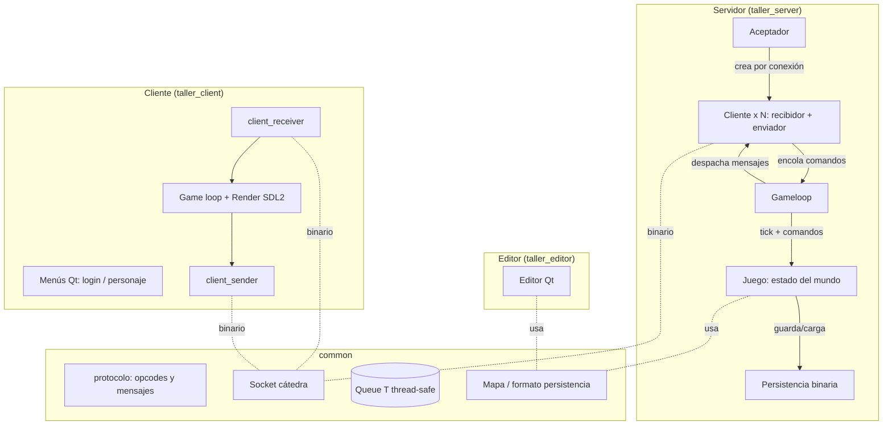
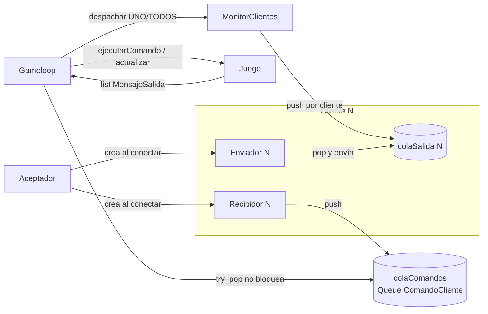
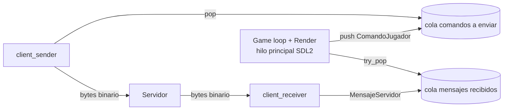
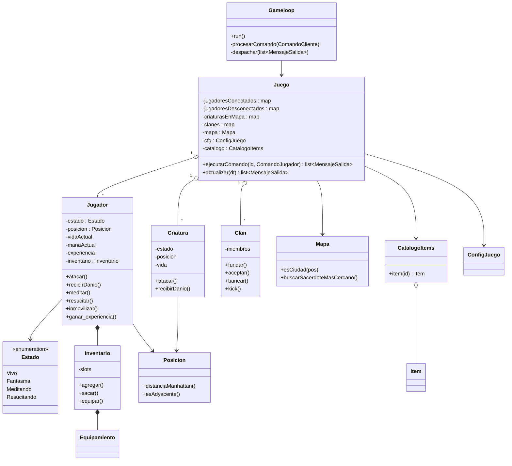
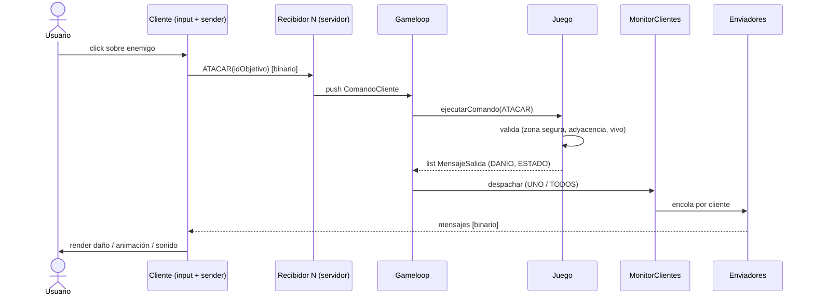
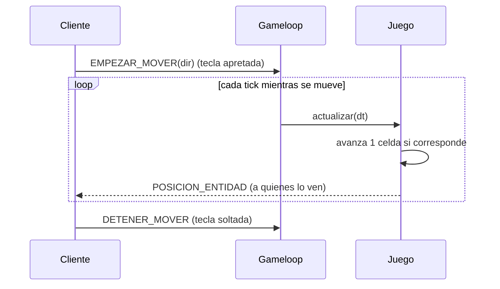
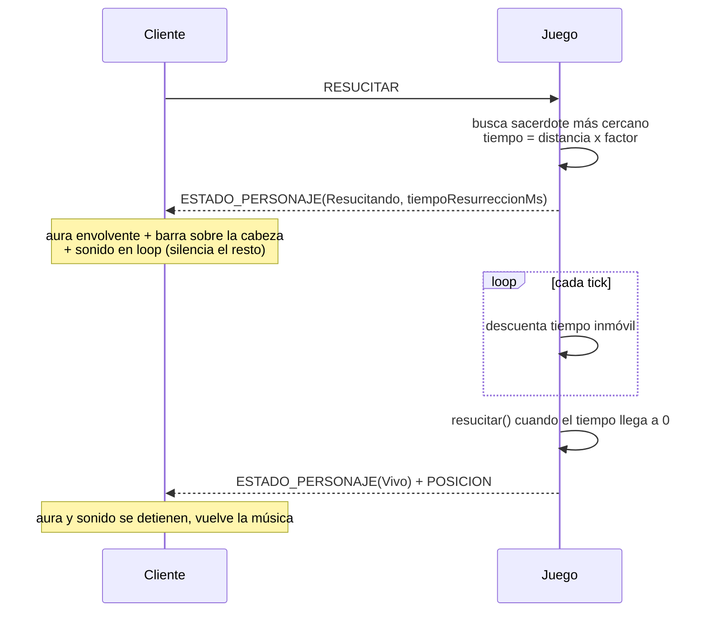

# Documentación Técnica — Argentum Online (FIUBA)

Documento para que otra persona desarrolladora entienda la arquitectura y pueda
continuar el desarrollo. Los diagramas están en **Mermaid**: GitHub, GitLab y la
mayoría de los editores Markdown los renderizan directamente (también
<https://mermaid.live>).

Documentos complementarios:

- [`doc/Gameloop.md`](../doc/Gameloop.md) — gameloop del servidor en detalle.
- [`doc/DecisionesDeDisenio.md`](../doc/DecisionesDeDisenio.md) — decisiones de modelado.
- [`doc/ProtocoloCliente.md`](../doc/ProtocoloCliente.md), [`doc/ProtocoloServidor.md`](../doc/ProtocoloServidor.md) — opcodes y payloads.

---

## 1. Visión general

El proyecto son **tres ejecutables** más una librería común:

- **Servidor** (`taller_server`): mantiene el estado del mundo, aplica la lógica
  de juego y persiste a los jugadores. Sin interfaz gráfica.
- **Cliente** (`taller_client`): interfaz gráfica (SDL2) + menús (Qt). Envía
  comandos y dibuja el estado que recibe.
- **Editor** (`taller_editor`): aplicación Qt para crear mapas (`mapa.toml`).
- **`common/`**: código compartido (protocolo, socket de la cátedra, colas
  thread-safe, formato de persistencia, modelo de mapa).

Restricciones de diseño respetadas (del enunciado):

- **C++20**; comunicación **binaria** sobre el `Socket` de la cátedra (bloqueante).
- **Lógica de juego desacoplada** del motor gráfico y de la red.
- **RAII** estricto para recursos (sockets, hilos, texturas, audio).
- **Configuración en TOML** externo; **persistencia binaria** de tamaño fijo con
  índice en RAM (`unordered_map` nombre → offset).



---

## 2. Modelo de hilos del servidor

Regla central: **todo el estado del juego vive en un único hilo (el Gameloop)**,
sin concurrencia interna. Los hilos de red solo _transportan_ datos a través de
colas thread-safe (`Queue<T>`).

- **Aceptador**: acepta conexiones TCP; por cada cliente crea un objeto cliente
  con **dos hilos**: un **recibidor** (lee del socket → traduce a `ComandoCliente`
  → encola en la cola de comandos) y un **enviador** (toma mensajes de la cola de
  salida del cliente → serializa → escribe al socket).
- **Gameloop** (1 hilo): procesa eventos de sesión, drena la cola de comandos,
  llama a `Juego::actualizar(dt)` (tick del mundo) y **despacha** los mensajes
  resultantes vía `MonitorClientes`.



### Ciclo del Gameloop

```
mientras (servidor activo):
  1. procesar eventos de sesión (conexión/desconexión)
  2. drenar la cola de comandos (try_pop) y aplicarlos a Juego
  3. Juego::actualizar(dt)         ← tick del mundo
  4. despachar mensajes de salida (UNO a un cliente / TODOS broadcast)
  5. dormir tick_ms (config TOML)
```

`MensajeSalida` envuelve un `MensajeServidor` con su **destino**
(`TipoDestino::UNO` + idCliente, o `TipoDestino::TODOS`). Esto mantiene a `Juego`
independiente de la red: solo produce mensajes con destino, no sabe de sockets.

---

## 3. Modelo de hilos del cliente

El cliente separa **red** de **render**:

- **client_receiver** (1 hilo): lee mensajes del servidor → los encola.
- **client_sender** (1 hilo): toma comandos del usuario → los serializa y envía.
- **Game loop / render** (hilo principal, _constant rate loop_): drena la cola de
  mensajes recibidos y actualiza el `ObjectGameWorld`, procesa input (teclado/
  mouse), actualiza animaciones según frames transcurridos y dibuja con SDL2.



El estado del mundo del lado del cliente se concentra en
[`ObjectGameWorld`](../client/interface/client_game_world.h): mantiene las
entidades visibles, los stats del propio jugador, el inventario, el chat y el
estado de animación. El render (`ObjectRenderer`) **solo lee** ese estado.

---

## 4. Dominio del servidor (diagrama de clases)

Centrado en `Juego` y las clases que orquesta. No se detallan todos los métodos:
solo los más representativos.



Notas de modelado (ver [`doc/DecisionesDeDisenio.md`](../doc/DecisionesDeDisenio.md) — decisiones de modelado.):

- **`Posicion`** es un _value object_ con métodos de distancia (combate,
  resurrección, bonus de clan).
- **`Estado`** centraliza el ciclo de vida del jugador en un solo `enum class`
  (evita flags booleanos desincronizados). `estaVivo()` = `Vivo || Meditando`;
  `esFantasma()` = `Fantasma || Resucitando`.
- **Items por herencia** (`Arma`, `Baculo`, `Defensa`, `Pocion` : `Item`).
- El **banco** no es una clase aparte: es global, sus datos viven en `Jugador`.
- No implementamos Clanes (fuera de scope, ver [minuta reunion](../minutas/minuta_sabado06junio2026.md))

---

## 5. Secuencias importantes

### 5.1 Flujo de un comando (atacar)



### 5.2 Movimiento _server-driven_

El movimiento lo conduce el servidor: el cliente solo avisa **cuándo empieza** y
**cuándo termina** ([ver minuta](../minutas/minuta_sabado06junio2026.md)) de moverse en una dirección; el servidor avanza una celda por
tick mientras dure.



### 5.3 Resurrección (aura + barra + sonido)



---

## 6. Protocolo de comunicación

**Formato:** binario sobre el `Socket` de la cátedra. Cada mensaje empieza con
**1 byte de `Opcode`**; luego siguen los campos del payload en un orden fijo,
con enteros enviados byte a byte (helpers `enviar/recibirUnByte`,
`DosBytes` = uint16, `CuatroBytes` = uint32; las cadenas van con longitud + bytes).

- **Cliente → Servidor:** [`ComandoJugador`](../common/protocolo/comando_jugador.h)
  = `Opcode` + `std::variant` con el payload. Comandos sin payload (`MEDITAR`,
  `RESUCITAR`, `TOMAR`…) usan structs vacíos.
- **Servidor → Cliente:** [`MensajeServidor`](../common/protocolo/mensaje_servidor.h)
  = `Opcode` + `std::variant` con el payload.

Quién arma/interpreta cada paquete:

- `ProtocoloCliente` / `ProtocoloServidor` **serializan y deserializan** cada
  tipo de mensaje (una función por opcode).
- En el servidor, `TraductorProtocolo` convierte los **eventos internos** de
  `Juego` (`EventoSalida`) a los `MensajeServidor` del protocolo, desacoplando la
  lógica de juego del formato de red.

La lista completa de opcodes y el layout de cada payload está en
[`common/protocolo/opcode.h`](../common/protocolo/opcode.h) y documentada en
[`doc/ProtocoloCliente.md`](../doc/ProtocoloCliente.md) /
[`doc/ProtocoloServidor.md`](../doc/ProtocoloServidor.md). Resumen de familias:

| Dirección          | Opcodes (ejemplos)                                                                                                                                                                                                                                         |
| ------------------ | ---------------------------------------------------------------------------------------------------------------------------------------------------------------------------------------------------------------------------------------------------------- |
| Cliente → Servidor | `EMPEZAR_MOVER`, `DETENER_MOVER`, `ATACAR`, `MEDITAR`, `RESUCITAR`, `CURAR`, `TOMAR`, `TIRAR`, `EQUIPAR`, `USAR`, `COMPRAR`/`VENDER`, banco, clan, chat, `LANZAR_HECHIZO`, `CHEAT`                                                                         |
| Servidor → Cliente | `ESTADO_PERSONAJE`, `POSICION_ENTIDAD`, `ENTIDAD_DESAPARECIO`, `DANIO_RECIBIDO`/`PRODUCIDO`, `ESQUIVE`, `MUERTE_ENTIDAD`, items/oro en suelo, inventario/equipamiento, chat/clan, `RESUCITADO`, banco, hechizos, `FX_HECHIZO`, `PROYECTIL`, `ERROR_ACCION` |

Los errores de acción se reportan con `ERROR_ACCION` + un código
(`CodigoErrorAccion`), que el cliente traduce a un texto legible en el chat.

---

## 7. Formato de archivos

### 7.1 Configuración (TOML, texto)

`game_config.toml`, `client_config.toml`, `mapa.toml`, `criaturas.toml`,
`pisos.toml`, más `sprites.toml` y `sonidos.toml` en los recursos del cliente.
Se parsean con **toml++** una sola vez al arranque. El `mapa.toml` se usa tanto
por el servidor (mundo) como por el editor y el cliente (render).

### 7.2 Persistencia de jugadores (binario, tamaño fijo)

Dos archivos:

- **`jugadores.bin`**: secuencia de `RegistroJugador`, un **struct de 256 bytes
  exactos** (con `_pad` explícitos y `static_assert(sizeof == 256)` para no
  depender del padding del compilador).
- **`jugadores_indice.bin`**: secuencia de `IndiceEntrada` (`char nombre[32]` +
  `uint64 offset`, 40 bytes), que en RAM se vuelve un
  `unordered_map<nombre, offset>` para localizar un personaje por nombre en O(1).

Layout de `RegistroJugador` (256 bytes):

|  Offset | Campo                                                      | Tipo       | Bytes |
| ------: | ---------------------------------------------------------- | ---------- | ----: |
|       0 | `nombre`                                                   | `char[32]` |    32 |
|      32 | `idClan`                                                   | uint16     |     2 |
|      34 | `clase`, `raza`, `nivel`, `fundadoClan`, `estado`, `_pad1` | 6× uint8   |     6 |
|      40 | `skinCabeza`, `skinCuerpo`                                 | 2× uint16  |     4 |
|      44 | `vidaActual`, `manaActual`                                 | 2× uint16  |     4 |
|      48 | `experiencia`                                              | uint32     |     4 |
|      52 | `oroMano`, `oroExceso`, `oroBanco`, `oroPerdidoPendiente`  | 4× uint32  |    16 |
|      68 | `mapaId`, `posX`, `posY`, `_pad2`                          | 4× uint16  |     8 |
|      76 | `inventarioSlots[20]`                                      | uint16×20  |    40 |
|     116 | `equipArma/Baculo/Defensa/Casco/Escudo`, `_pad3`           | 6× uint16  |    12 |
|     128 | `itemsBanco[64]`                                           | uint16×64  |   128 |
| **256** | **(total)**                                                |            |       |

No se guardan campos derivables (id de sesión, fuerza/agilidad/inteligencia/
constitución, `vidaMax`/`manaMax`): se **recalculan** a partir de raza, clase y
nivel al reconstruir el `Jugador` (`SerializadorJugador::aJugador`), por lo que no
ocupan espacio en disco. Al guardar se hace el camino inverso (`aRegistro`).

---

## 8. Constant rate loop y animación

El cliente usa un _constant rate loop_: si se pierden frames, la lógica de
animación avanza según la **cantidad de frames/ticks transcurridos**, no según
tiempo real. El `SpriteManager` recibe ese contador y elige el cuadro del sprite
correspondiente, manteniendo la velocidad de animación estable aunque baje el FPS.
El movimiento es íntegramente _server-driven_ (sin interpolación del lado del
cliente, decisión tomada para simplificar y estabilizar — ver el manual de
proyecto).
